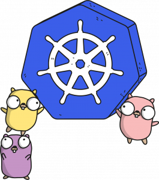

# K8S Visitor Mode


abordarei 

Neste artigo iremos abordar principalmente um padrão de programação usado nos comandos kubectl
– *Visitor* (Nota: Na verdade, kubectl são principalmente usados dois, um é o Builder e o outro é o Visitor).
Originalmente, o Visitor é um modelo de design muito importante no modelo de *design orientado a objetos* [consulte a entrada Wikipedia Visitor Pattern](https://en.wikipedia.org/wiki/Visitor_pattern),
esse padrão é uma maneira de separar o algoritmo da estrutura do objeto operacional.
O resultado prático dessa separação é a capacidade de adicionar novas operações a uma estrutura de objeto existente sem modificar a estrutura,
uma abordagem que segue o princípio *aberto/fechado*.

Neste artigo, vamos nos concentrar em como implementar esse padrão usando uma abordagem funcional.

## Content
1) [Simple example](#simple-example)
2) [k8s related background](#k8s-related-background)
3) [Implementation of kubectl](#implementation-of-kubectl)
   1) [Visitor pattern definition](#visitor-pattern-definition)
   2) [Name Visitor](#name-visitor)
   3) [Other Visitor](#other-visitor)
   4) [Log Visitor](#log-visitor)
   5) [consumer code](#consumer-code)
   6) [Visitor decorator](#visitor-decorator)

## Simple example
Vejamos primeiro um exemplo de Visitor com um padrão de design simples.
- Nosso código possui uma  definição de função Visitor e uma interface Shape que recebe uma função como parâmetro Visitor.
- O objeto da nossa instância Circle e o método que Rectangle *accept()* implementa a interface Shape, 
esse método espera que a parte externa me passe um Visitor.
- 
````go
package main

import (
    "encoding/json"
    "encoding/xml"
    "fmt"
)

type Visitor func(shape Shape)

type Shape interface {
    accept(Visitor)
}

type Circle struct {
    Radius int
}

func (c Circle) accept(v Visitor) {
    v(c)
}

type Rectangle struct {
    Width, Heigh int
}

func (r Rectangle) accept(v Visitor) {
    v(r)
}
````

Em seguida, implementamos dois Visitors, um para serialização JSON e outro para serialização XML

````go
func JsonVisitor(shape Shape) {
    bytes, err := json.Marshal(shape)
    if err != nil {
        panic(err)
    }
    fmt.Println(string(bytes))
}

func XmlVisitor(shape Shape) {
    bytes, err := xml.Marshal(shape)
    if err != nil {
        panic(err)
    }
    fmt.Println(string(bytes))
}
````
Abaixo está nosso código usando o modo Visitante
````go
func main() {
  c := Circle{10}
  r :=  Rectangle{100, 200}
  shapes := []Shape{c, r}

  for _, s := range shapes {
    s.accept(JsonVisitor)
    s.accept(XmlVisitor)
  }

}
````

Na verdade, o objetivo deste código é desacoplar a estrutura de dados e o algoritmo, isso pode ser feito usando o modo Strategy, e ficará mais limpo.
Mas em alguns casos, vários visitantes devem acessar diferentes partes de uma estrutura de dados, neste caso,
a estrutura de dados é um pouco como um banco de dados, e cada visitante se tornará um pequeno aplicativo. kubectl nosso é o caso.

## k8s related background

Em seguida, vamos dar uma olhada no histórico de conhecimento relevante:

- Para Kubernetes, ele abstrai muitos tipos de Recurso, como: *Pod, ReplicaSet, ConfigMap, Volumes, Namespace, Roles.*
Existem muitos tipos, essas coisas constituem o modelo de dado do Kubernetes (clique no [mapa Kubernetes Resources](https://github.com/kubernauts/practical-kubernetes-problems/blob/master/images/k8s-resources-map.png) para ver como é complicado)
- **kubectl** - É um comando de cliente no Kubernetes, e o operador usa esse comando para operar o Kubernetes.
O kubectl entrará em contato com o API Server do Kubernetes, e o API Server entrará em contato com cada node kubelet para controlá-lo
- **kubectl** - O trabalho principal é processar os itens enviados pelo usuário (incluindo parâmetros de linha de comando, arquivos yaml, etc.) e,
em seguida, organizar esses itens enviados pelo usuário numa estrutura de dados e enviá-los ao servidor de API.
- O código fonte relevante está src/k8s.io/cli-runtime/pkg/resource/visitor.goem ( [link fonte](https://github.com/kubernetes/kubernetes/blob/cea1d4e20b4a7886d8ff65f34c6d4f95efcb4742/staging/src/k8s.io/cli-runtime/pkg/resource/visitor.go) )

O código do *kubectl* é mais complexo, mas o princípio é simples, ele obtém informações da linha de comando e do arquivo yaml,
e as converte numa série de recursos através do modo *Builder*, e por fim utiliza o modo Visitor mode para processar esses Reources de forma iterativa.

Vamos dar uma olhada na implementação do kubectl. Para simplificar, vou mostrá-lo com um pequeno exemplo em vez de analisar diretamente o código-fonte complexo.

### Implementation of kubectl

### Visitor pattern definition

Em primeiro lugar, kubectl é usado principalmente para lidar com estruturas Info. Seguem as definições relevantes:
````go
type VisitorFunc func(*Info, error) error

type Visitor interface {
    Visit(VisitorFunc) error
}

type Info struct {
    Namespace   string
    Name        string
    OtherThings string
}

func (info *Info) Visit(fn VisitorFunc) error {
  return fn(info, nil)
}
````

Nós podemos ver isso,
- Existe uma definição de um tipo de função de **Visitor Func**
- Uma interface Visitor com os *Visit(VisitorFunc) error*  métodos necessários (isto é como nosso exemplo acima Shape)
- Finalmente, para implementar Info o método na interface Visitor, a implementação Visit() é chamar diretamente o método de entrada
(semelhante ao exemplo anterior)

Vamos definir vários tipos diferentes de Visitantes.

### Name Visitor

Este Visitor é usado principalmente para  o Info acessar o Name e NameSpace membros na estrutura.

````go
type NameVisitor struct {
  visitor Visitor
}

func (v NameVisitor) Visit(fn VisitorFunc) error {
  return v.visitor.Visit(func(info *Info, err error) error {
    fmt.Println("NameVisitor() before call function")
    err = fn(info, err)
    if err == nil {
      fmt.Printf("==> Name=%s, NameSpace=%s\n", info.Name, info.Namespace)
    }
    fmt.Println("NameVisitor() after call function")
    return err
  })
}
````

Podemos ver que o código acima:

- Uma struct NameVisitor é declarada, que possui um membro Visitor de interface, o que significa polimorfismo.
- Ao implementar um método Visit(), ele chama o método Visitor em sua própria estrutura, 
que na verdade é um padrão decorador que se decora com outro Visitor Visitor() (para o padrão decorador, [consulte "Go Programming Patterns: Decorators"](../decorator/pipeline_multiple_decorator))

### Other Visitor

Este Visitor é usado principalmente para Info acessar OtherThings membros na estrutura
````go
type OtherThingsVisitor struct {
  visitor Visitor
}

func (v OtherThingsVisitor) Visit(fn VisitorFunc) error {
  return v.visitor.Visit(func(info *Info, err error) error {
    fmt.Println("OtherThingsVisitor() before call function")
    err = fn(info, err)
    if err == nil {
      fmt.Printf("==> OtherThings=%s\n", info.OtherThings)
    }
    fmt.Println("OtherThingsVisitor() after call function")
    return err
  })
}
````
A lógica de implementação é a mesma acima, e não vou falar sobre isso novamente.

### Log Visitor

````go
type LogVisitor struct {
  visitor Visitor
}

func (v LogVisitor) Visit(fn VisitorFunc) error {
  return v.visitor.Visit(func(info *Info, err error) error {
    fmt.Println("LogVisitor() before call function")
    err = fn(info, err)
    fmt.Println("LogVisitor() after call function")
    return err
  })
}
````
### consumer code
Agora vamos ver se usamos o código acima:
````go
func main() {
  info := Info{}
  var v Visitor = &info
  v = LogVisitor{v}
  v = NameVisitor{v}
  v = OtherThingsVisitor{v}

  loadFile := func(info *Info, err error) error {
    info.Name = "Hao Chen"
    info.Namespace = "MegaEase"
    info.OtherThings = "We are running as remote team."
    return nil
  }
  v.Visit(loadFile)
}
````
No código acima, podemos ver

- Visitantes camada por camada
- Eu uso loadFile para fingir ler dados de um arquivo como
- A última parte do nosso código v.Visit(loadfile) acima de tudo começa a ser ativada.

O código acima gera as seguintes informações, você pode ver como a ordem de execução do código é executada
````shell
LogVisitor() before call function
NameVisitor() before call function
OtherThingsVisitor() before call function
==> OtherThings=We are running as remote team.
OtherThingsVisitor() after call function
==> Name=Hao Chen, NameSpace=MegaEase
NameVisitor() after call function
LogVisitor() after call function
````
Podemos ver que o código acima tem os seguintes efeitos:

- Dados e programas desacoplados.
- O padrão decorador é usado
- Também faça um modo de pipeline

Então, de fato, podemos refatorar o código acima.

### Visitor decorator

Em seguida, usamos o padrão decorador para refatorar o código acima.

````go
type DecoratedVisitor struct {
  visitor    Visitor
  decorators []VisitorFunc
}

func NewDecoratedVisitor(v Visitor, fn ...VisitorFunc) Visitor {
  if len(fn) == 0 {
    return v
  }
  return DecoratedVisitor{v, fn}
}

// Visit implements Visitor
func (v DecoratedVisitor) Visit(fn VisitorFunc) error {
  return v.visitor.Visit(func(info *Info, err error) error {
    if err != nil {
      return err
    }
    if err := fn(info, nil); err != nil {
      return err
    }
    for i := range v.decorators {
      if err := v.decorators[i](info, nil); err != nil {
        return err
      }
    }
    return nil
  })
}
````

O código acima não é complicado,

- Use uma estrutura * Decorated Visitor* para armazenar todas as funções VistorFunc
- Você pode passar NewDecoratedVisitor o VisitorFunc e tudo para ele para construir um objeto DecoratedVisitor.
- Implementado o método DecoratedVisitor Visit(), que é fazer um loop for e chamar todos os VisitorFunc

Então, nosso código pode funcionar assim:

````go
info := Info{}
var v Visitor = &info
v = NewDecoratedVisitor(v, NameVisitor, OtherVisitor)

v.Visit(LoadFile)
````

É mais simples que o anterior? Observe que isso DecoratedVisitor também pode ser usado como um visitante.

Bem, todos os códigos acima existem no código do kubectl. Se você entender a lógica do código aqui, acredito que também possa entender código do kubectl.
